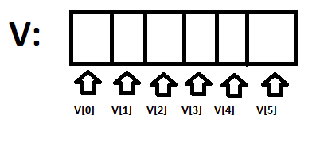

# Egydimenziós tömbök

Programozás során találkozhatunk olyan feladatokkal, amelyek megoldása során több azonos típusú adatot kell tároljon. Az eddig használt tárolási mód erre nem célszerű, hiszen ha több száz egész számot szeretnénk tárolni akkor több száz változóra van szükségünk. Az ilyen típusú adatok tárolására alkalmasak a tömbök. 

A tömb tehát egy olyan adatszerkezet amely egy rögzített számú, azonos típusú elemekből épül fel. Az elemeket a tömbön belül az indexeik segítségével azonosíthatjuk.

A tömb a memóriában lineárisan van tárolva, hasonlít egy olyan fiókra amely több rekeszre van felosztva. Nevet csak a "fióknak" adunk, a "rekeszeket" meg megszámozzuk \(indexeljük\).



#### Megjegyzések

A C++ nyelvben az indexelés automatikus. Az első elem mindig 0. elem \(0-s indexel rendelkezik\).

Az egydimenziós tömböket vektoroknak is nevezzük.

Deklarálása a következő:

```cpp
ELEMTÍPUS TÖMBVÁLTOZÓ_NEVE [ TÖMBMÉRET ];
```

Az elemtípusnál határozzuk meg, hogy a tömb milyen adattípusú elemeket tartalmazhat, a tömbméret pedig a tömbben tárolható maximális elem darabszámait jelenti.

#### Egydimenziós tömbök inicializálása

```cpp
int a[4] = {2, 4, -1, 6};
```

| Elem | 2 | 4 | -1 | 6 |
| :--- | :--- | :--- | :--- | :--- |
| Index | 0 | 1 | 2 | 3 |

Azt is megtehetjük, hogy nem inicializáljuk \(adunk értéket\) a tömb összes elemét, ilyenkor a compiler automatikusan 0 kezdőértékkel látja el a nem inicializált elemet.

```cpp
int b[6] = {-7, 7, 8};
```

| Elem | -7 | 7 | 8 | 0 | 0 | 0 |
| :--- | :--- | :--- | :--- | :--- | :--- | :--- |
| Index | 0 | 1 | 2 | 3 | 4 | 5 |

Ha ismerjük inicializáláskor a tömb összes elemét akkor nem muszály tömbméretet megadni, hiszen automatikusan annyi lesz ahányat felsoroltunk.

```cpp
int c[] = {2, 7, 8};
```


