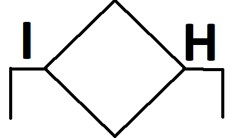

# Az algoritmusok leírásának módszerei

1. Folyamatábra
2. Mondatszerű leírás \(pszeudokód\)
3. Struktogramm

## A folyamatábra

A műveleteket blokkok segítségével írjuk le.

A fontosabb blokkok:




## A folyamatábra előnye: 

Áttekinthető

## A folyamatábra hátránya: 

1. Nagyobb algoritmusok írására nem alkalmas
2. Nehéz kijavítani

## Mondatszerű leírás \(pszeudokód\)

Algoritmusok leírása utasítások segítéségével történik

```text
Be: a,b
c = (a + b) / 2
Ha c >= 4.5 akkor
    Ki: "Átment"
külömben
    Ki: "Megbukott"
```

### A pszeudokód előnye

Nehezebb algoritmusok írására is alkalmas

Nagyon hasonlít a programozási nyelvekhez, ezért könnyen átalakítható programmá.

### A pszeudokód hátránya

Nem annyira áttekinthető

## A struktogram

Próbálták mindkét módszer előnyeit ötvözni, de jelenleg kevés helyen használják.

